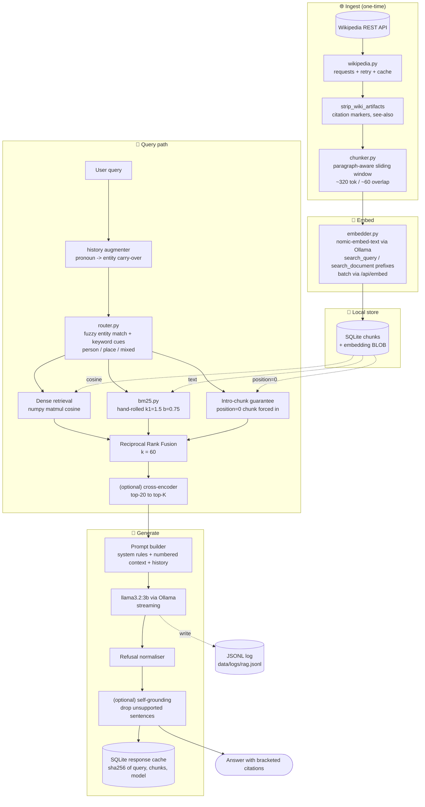

# Local Wikipedia RAG Assistant

A ChatGPT-style assistant that answers questions about famous people and famous places using **only local resources**. Wikipedia ingestion, embeddings, vector search, and language-model generation all run on `localhost`. No external LLM API is contacted.

> ITU BLG483E — Project 3 · Fatih Çakır (150220086)

---

## Architecture



The dashed arrows show metadata reads from the SQLite store; everything else is synchronous in-process Python. No external service is contacted at query time.

## What it does

1. **Ingests** 30 famous people + 30 famous places from Wikipedia (configurable).
2. **Chunks** each article with a paragraph-aware sliding window (target ≈320 tokens, ≈60 token overlap).
3. **Embeds** every chunk with a local `nomic-embed-text` model running under Ollama.
4. **Stores** chunks + embeddings in a hand-rolled SQLite + NumPy vector store (no Chroma, no pgvector).
5. **Routes** each query to *person*, *place*, *mixed*, or *unknown* using rule + entity-name matching.
6. **Retrieves** with hybrid ranking — dense cosine + hand-rolled BM25, fused via Reciprocal Rank Fusion.
7. **Generates** the final answer with a local Ollama LLM (`llama3.2:3b` by default), grounded in the retrieved context, with inline `[1] [2]` citations.
8. **Returns** `"I don't know based on the provided context."` whenever the answer is not supported.

---

## Optional extensions implemented (all of them — and then some)

The brief lists 8 optional extensions. We implement all 8 plus 7 additional polish features.

**From the brief:**

- ✅ **Streaming responses** — Ollama stream API, token-by-token in CLI and Streamlit
- ✅ **Citations / source highlighting** — every factual sentence ends with a `[N]` citation; the expander shows full source text + URLs
- ✅ **Chat history memory** — sliding-window of the last 6 turns sent to the model, plus pronoun-aware retrieval augmentation
- ✅ **Compare two different local models** — sidebar toggle renders both answers side-by-side
- ✅ **Latency measurement** — retrieve / generate / grounding / total per turn, plus a dedicated dashboard page
- ✅ **Response caching** — SQLite KV keyed by `sha256(query | chunk-ids | model)`, ~100x speed-up on hits
- ✅ **Improved retrieval ranking** — dense cosine + hand-rolled BM25 + Reciprocal Rank Fusion + intro-chunk guarantee + optional cross-encoder reranker
- ✅ **Comparison questions across people and places** — mixed routing with per-entity sub-retrieval so each subject contributes chunks

**Additional features:**

- ✅ **Fuzzy entity matching** — Levenshtein-tolerant routing handles typos like "sagopa kajmet", "picasoo", "einsteen"
- ✅ **Self-grounding check** (optional toggle) — second LLM pass marks each sentence supported / unsupported and prunes the answer
- ✅ **Refusal normalisation** — paraphrased "no answer" responses are deterministically rewritten to the canonical brief sentence
- ✅ **Health check on startup** — Streamlit shows the status of Ollama, each required model, and the vector store; refuses to chat if anything critical is missing
- ✅ **Persistent chat history** — every conversation is saved to `data/conversations/<id>.json` and listed in the sidebar
- ✅ **Export conversation as Markdown** — one click, full transcript with sources
- ✅ **Entity quick-launch sidebar** — clickable list of all 60 entities, ready-made queries
- ✅ **Pre-computed example chips** — one-tap test queries on first launch
- ✅ **Latency dashboard page** — recent retrieve/generate timings as a chart + table from the JSONL log
- ✅ **About page** — architecture overview + corpus stats inside the running app
- ✅ **Pre-warm LLM** — background ping during boot so the first answer doesn't pay the cold-start tax
- ✅ **Structured JSON logging** — append-only NDJSON in `data/logs/rag.jsonl`

---

## Repository layout

```
.
├── README.md
├── Product_prd.md              # PRD describing what to build
├── recommendation.md           # Production deployment recommendations
├── requirements.txt
├── data/
│   ├── people.txt              # 30 entities
│   ├── places.txt              # 30 entities
│   ├── raw/                    # cached Wikipedia JSONs (gitignored)
│   ├── conversations/          # persistent chat history (gitignored)
│   └── logs/                   # rag.jsonl structured logs (gitignored)
├── scripts/
│   ├── setup.sh                # macOS / Linux quickstart
│   └── setup.ps1               # Windows PowerShell quickstart
├── tests/
│   ├── test_unit.py            # chunker, BM25, router, store, citation, fuzzy, persistence
│   ├── test_e2e.py             # 20 example queries against the live pipeline
│   ├── test_extensions.py      # 8 optional extensions verified
│   └── debug_chunks.py         # dump retrieved chunks for a query
└── src/
    ├── config.py
    ├── log.py                  # structured JSON-line logging
    ├── ingest/    wikipedia.py · run_ingest.py
    ├── chunk/     chunker.py
    ├── embed/     embedder.py
    ├── store/     vector_store.py
    ├── retrieve/  router.py · bm25.py · retriever.py · reranker.py
    ├── generate/  llm.py · pipeline.py · grounding.py
    ├── cache/     response_cache.py
    └── ui/        cli.py · streamlit_app.py · health.py · persistence.py
```

---

## Prerequisites

- **Python 3.10+** (3.11 recommended)
- **Ollama** for the local LLM and the embedding model — <https://ollama.com/download>
- An internet connection for the **first** ingestion run only (to fetch Wikipedia articles); the system never calls remote LLM APIs.

---

## 1 — Install Ollama and pull the models

```bash
# After installing Ollama, in a separate terminal:
ollama serve

# Pull the required models (one-time):
ollama pull llama3.2:3b
ollama pull nomic-embed-text
# Optional — only needed if you want to use the "Compare two models" feature:
ollama pull phi3:mini
```

Verify the models are visible:

```bash
ollama list
```

---

## 2 — Install Python dependencies

```bash
python -m venv .venv
# Windows PowerShell:
.\.venv\Scripts\Activate.ps1
# macOS / Linux:
source .venv/bin/activate

pip install -r requirements.txt
```

Or run the helper script:

```bash
# macOS / Linux
bash scripts/setup.sh
# Windows PowerShell
./scripts/setup.ps1
```

---

## 3 — Ingest the Wikipedia data

```bash
python -m src.ingest.run_ingest
```

The script:

1. Resolves each name in `data/people.txt` and `data/places.txt` to a canonical Wikipedia article (English Wikipedia `query` API).
2. Caches the plain-text extract under `data/raw/<type>/<slug>.json` so subsequent runs are instant.
3. Chunks every article and embeds each chunk with `nomic-embed-text` via Ollama.
4. Writes everything into `data/rag.db` (SQLite + numpy BLOB embeddings).

Useful flags:

| Flag             | Effect                                                                 |
| ---------------- | ---------------------------------------------------------------------- |
| `--reset`        | Drop and recreate the vector store before ingesting.                   |
| `--force-fetch`  | Ignore the on-disk Wikipedia cache and re-download every article.      |
| `--only people`  | Only ingest people.                                                    |
| `--only places`  | Only ingest places.                                                    |

Expected runtime on a modern laptop: **~2 minutes** for the full 60-entity corpus (≈3 000 chunks) using Ollama's batch embedding endpoint.

---

## 4 — Start the application

### Option A — Streamlit web UI (recommended for the demo)

```bash
streamlit run src/ui/streamlit_app.py
```

Then open <http://localhost:8501>. The app has three pages, switchable from the sidebar:

- **💬 Chat** — main RAG chat with model selection, "compare two models" toggle, top-K slider, streaming toggle, response-cache toggle, **🔬 self-grounding check** toggle, **🎯 cross-encoder reranker** toggle, "show retrieved context", clear-chat, wipe-cache, **export conversation as Markdown**, **past conversations list**, **entity quick-launch** (60 clickable entities), **pre-computed example chips** on first launch.
- **⚡ Latency Dashboard** — live charts and table of recent retrieve / generate / grounding timings, read from `data/logs/rag.jsonl`.
- **📐 About** — architecture overview, design rationale, model status, corpus stats.

A **system status panel** at the top of the sidebar runs health checks (Ollama reachable? models pulled? store populated?) and refuses to chat if anything critical is missing.

### Option B — CLI

```bash
python -m src.ui.cli
```

CLI commands:

```
/show           toggle inline context display
/context        print the most recently retrieved chunks
/clear          clear conversation history
/reset-cache    wipe the response cache
/model NAME     switch LLM (e.g. /model phi3:mini)
/stream on|off  toggle streaming
/stats          show store + cache stats
/help           help
/exit           quit
```

---

## Example queries

**People**

- Who was Albert Einstein and what is he known for?
- What did Marie Curie discover?
- Why is Nikola Tesla famous?
- Compare Lionel Messi and Cristiano Ronaldo.
- What is Frida Kahlo known for?

**Places**

- Where is the Eiffel Tower located?
- Why is the Great Wall of China important?
- What is Machu Picchu?
- What was the Colosseum used for?
- Where is Mount Everest?

**Mixed**

- Which famous place is located in Turkey?
- Which person is associated with electricity?
- Compare Albert Einstein and Nikola Tesla.
- Compare the Eiffel Tower and the Statue of Liberty.

**Failure cases (system should refuse)**

- Who is the president of Mars?
- Tell me about a random unknown person John Doe.

---

## Design choices, briefly

| Decision | Choice | Reason |
| --- | --- | --- |
| LLM | `llama3.2:3b` via Ollama | Best quality/speed trade-off on a laptop; instruction-tuned. |
| Embeddings | `nomic-embed-text` via Ollama | Same runtime as the LLM, 768-d, strong on Wikipedia-style English. |
| Vector store | SQLite + NumPy (no Chroma) | The brief asks for native functionality; ~150 LoC, exact cosine, single process, single file. |
| Vector layout | **One** store, `type` metadata (Option B) | Keeps mixed/comparison questions trivial — same store, optional filter. |
| Chunking | Paragraph-aware sliding window, ~320 tokens, ~60 overlap | Wikipedia paragraphs are coherent — preserve them; sentence-fall-back when a paragraph is oversized. |
| Routing | Rule-based: entity-name regex + keyword cues | Cheap, deterministic, zero-extra-LLM, exactly what the brief permits. |
| Retrieval | Dense + BM25 fused with RRF, k=60 | Dense for semantics, BM25 for rare proper nouns; RRF avoids score calibration. |
| Hallucination guard | Strict system prompt + empty-context short-circuit + paraphrase normaliser + optional self-grounding pass | Returns the canonical "I don't know based on the provided context." sentinel exactly as required by the brief. |
| Embedding prefixes | `search_query: ` / `search_document: ` for `nomic-embed-text` | The model is task-conditioned — using the prefixes the model was trained for measurably improves retrieval. |
| Typo handling | Levenshtein-tolerant entity matching in the router | Lets `sagopa kajmet`, `picasoo`, `einsteen` route correctly without an LLM rewrite step. |

See [`recommendation.md`](recommendation.md) for production-deployment notes and [`Product_prd.md`](Product_prd.md) for the requirements view.

---

## Tests

Three suites are included; run them in this order:

```bash
# 1. Unit tests — no Ollama, no store needed (≤5s)
python tests/test_unit.py

# 2. End-to-end tests — needs Ollama + populated store (~90s, 20 queries)
python tests/test_e2e.py

# 3. Optional-extension verification — needs Ollama + store (~60s)
python tests/test_extensions.py
```

The extension suite explicitly verifies streaming, citations, chat-history pronoun resolution, dual-model compare, latency reporting, response caching, hybrid retrieval ranking and intro-chunk guarantee, and multi-entity comparison routing.

---

## Reset the system

```bash
# Wipe the vector store and start clean
python -m src.ingest.run_ingest --reset

# Or, manually:
rm data/rag.db data/cache.db
rm -rf data/raw/ data/conversations/ data/logs/
```

---

## Troubleshooting

- **`Connection refused` when ingesting** → `ollama serve` is not running. Start it in a separate terminal.
- **`model "nomic-embed-text" not found`** → run `ollama pull nomic-embed-text`.
- **Streamlit warns "no module named src"** → run from the project root, or use `python -m streamlit run src/ui/streamlit_app.py`.
- **Wikipedia rate-limiting** → the script already retries with exponential back-off; wait a minute and retry.

---

## Demo video

📺 **<https://youtu.be/5JZ2ktCqlZM>**

The video walks through:

1. System overview & architecture
2. Live ingestion (`python -m src.ingest.run_ingest`)
3. Q&A across people, places, mixed, and failure cases
4. Model choice and retrieval method tradeoffs
5. Limitations and possible improvements
